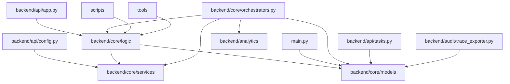

# Post-Refactor Audit

_Date: 2025-08-08_

## 1. Dependency Graphs

### Package-Level Module Graph


### Cross-Module Function Graph (logic package)
```mermaid
graph TD
    logic_analyze_report_analyze_credit_report --> logic_process_accounts_get
    logic_analyze_report_analyze_credit_report --> logic_report_postprocessing_validate_analysis_sanity
logic_analyze_report_analyze_credit_report --> REMOVED (parsing is deterministic)
    logic_analyze_report_analyze_credit_report --> logic_utils_inquiries_extract_inquiries
    logic_analyze_report_analyze_credit_report --> logic_utils_names_normalization_normalize_bureau_name
    logic_analyze_report_analyze_credit_report --> logic_utils_names_normalization_normalize_creditor_name
    logic_analyze_report_analyze_credit_report --> logic_utils_text_parsing_enforce_collection_status
    logic_analyze_report_analyze_credit_report --> logic_utils_text_parsing_extract_late_history_blocks
    logic_analyze_report_strip_unverified --> logic_process_accounts_get
    logic_analyze_report_strip_unverified --> logic_utils_names_normalization_normalize_creditor_name
    logic_bootstrap_extract_all_accounts --> logic_instruction_data_preparation_sanitize_number
    logic_bootstrap_extract_all_accounts --> logic_process_accounts_get
    logic_bootstrap_extract_all_accounts --> logic_utils_names_normalization_normalize_creditor_name
    logic_compliance_adapter_adapt_gpt_output --> logic_process_accounts_get
    logic_compliance_adapter_adapt_gpt_output --> logic_utils_names_normalization_normalize_creditor_name
    logic_compliance_adapter_sanitize_client_info --> logic_process_accounts_get
    logic_compliance_adapter_sanitize_disputes --> logic_process_accounts_get
    logic_compliance_adapter_sanitize_disputes --> logic_utils_names_normalization_normalize_creditor_name
    logic_compliance_pipeline_run_compliance_pipeline --> logic_guardrails_fix_draft_with_guardrails
    logic_constants_normalize_action_tag --> logic_process_accounts_get
    logic_dispute_preparation_dedupe_disputes --> logic_process_accounts_get
    logic_dispute_preparation_dedupe_disputes --> logic_utils_names_normalization_normalize_creditor_name
    logic_dispute_preparation_prepare_disputes_and_inquiries --> logic_fallback_manager_determine_fallback_action
    logic_dispute_preparation_prepare_disputes_and_inquiries --> logic_process_accounts_get
    logic_dispute_preparation_prepare_disputes_and_inquiries --> logic_utils_names_normalization_normalize_creditor_name
    logic_explanations_normalizer_extract_structured --> logic_json_utils_parse_json
    logic_explanations_normalizer_extract_structured --> logic_process_accounts_get
    logic_extract_info_extract_bureau_info_column_refined --> logic_instruction_data_preparation_extract_clean_name
    logic_extract_info_extract_bureau_info_column_refined --> logic_json_utils_parse_json
    logic_extract_info_extract_bureau_info_column_refined --> logic_utils_names_normalization_normalize_bureau_name
    logic_extract_info_extract_full_name --> logic_instruction_data_preparation_extract_clean_name
    logic_generate_custom_letters_call_gpt_for_custom_letter --> logic_guardrails_generate_letter_with_guardrails
    logic_generate_custom_letters_call_gpt_for_custom_letter --> logic_process_accounts_get
    logic_generate_custom_letters_call_gpt_for_custom_letter --> logic_rules_loader_get_neutral_phrase
    logic_generate_custom_letters_call_gpt_for_custom_letter --> logic_summary_classifier_classify_client_summary
    logic_generate_custom_letters_generate_custom_letter --> logic_process_accounts_get
    logic_generate_custom_letters_generate_custom_letter --> logic_utils_pdf_ops_gather_supporting_docs
    logic_generate_custom_letters_generate_custom_letters --> logic_process_accounts_get
    logic_generate_goodwill_letters_generate_goodwill_letter_with_ai --> logic_goodwill_preparation_prepare_account_summaries
    logic_generate_goodwill_letters_generate_goodwill_letter_with_ai --> logic_goodwill_prompting_generate_goodwill_letter_draft
    logic_generate_goodwill_letters_generate_goodwill_letter_with_ai --> logic_goodwill_rendering_render_goodwill_letter
    logic_generate_goodwill_letters_generate_goodwill_letter_with_ai --> logic_process_accounts_from_dict
    logic_generate_goodwill_letters_generate_goodwill_letter_with_ai --> logic_process_accounts_get
    logic_generate_goodwill_letters_generate_goodwill_letter_with_ai --> logic_process_accounts_to_dict
    logic_generate_goodwill_letters_generate_goodwill_letter_with_ai --> logic_utils_pdf_ops_gather_supporting_docs
    logic_generate_goodwill_letters_generate_goodwill_letters --> logic_goodwill_preparation_select_goodwill_candidates
    logic_generate_goodwill_letters_generate_goodwill_letters --> logic_process_accounts_from_dict
    logic_generate_goodwill_letters_generate_goodwill_letters --> logic_process_accounts_to_dict
    logic_generate_strategy_report_generate --> logic_guardrails_fix_draft_with_guardrails
    logic_generate_strategy_report_generate --> logic_json_utils_parse_json
    logic_generate_strategy_report_generate --> logic_process_accounts_get
    logic_generate_strategy_report_save_report --> logic_process_accounts_get
    logic_goodwill_preparation_consider_account --> logic_process_accounts_clean_num
    logic_goodwill_preparation_consider_account --> logic_process_accounts_get
    logic_goodwill_preparation_consider_account --> logic_utils_names_normalization_normalize_creditor_name
    logic_goodwill_preparation_consider_account --> logic_utils_text_parsing_has_late_indicator
    logic_goodwill_preparation_prepare_account_summaries --> logic_process_accounts_get
    logic_goodwill_preparation_prepare_account_summaries --> logic_rules_loader_get_neutral_phrase
    logic_goodwill_preparation_prepare_account_summaries --> logic_summary_classifier_classify_client_summary
    logic_goodwill_preparation_prepare_account_summaries --> logic_utils_names_normalization_normalize_creditor_name
    logic_goodwill_preparation_select_goodwill_candidates --> logic_process_accounts_clean_num
    logic_goodwill_preparation_select_goodwill_candidates --> logic_process_accounts_get
    logic_goodwill_preparation_select_goodwill_candidates --> logic_utils_names_normalization_normalize_creditor_name
    logic_goodwill_preparation_select_goodwill_candidates --> logic_utils_text_parsing_has_late_indicator
    logic_goodwill_prompting_generate_goodwill_letter_draft --> logic_json_utils_parse_json
    logic_goodwill_prompting_generate_goodwill_letter_draft --> logic_utils_pdf_ops_gather_supporting_docs
    logic_goodwill_rendering_load_creditor_address_map --> logic_utils_names_normalization_normalize_creditor_name
    logic_goodwill_rendering_render_goodwill_letter --> logic_process_accounts_get
    logic_goodwill_rendering_render_goodwill_letter --> logic_utils_file_paths_safe_filename
    logic_goodwill_rendering_render_goodwill_letter --> logic_utils_names_normalization_normalize_creditor_name
    logic_goodwill_rendering_render_goodwill_letter --> logic_utils_note_handling_get_client_address_lines
    logic_gpt_prompting_call_gpt_dispute_letter --> logic_json_utils_parse_json
    logic_gpt_prompting_call_gpt_dispute_letter --> logic_process_accounts_from_dict
    logic_gpt_prompting_call_gpt_dispute_letter --> logic_process_accounts_get
    logic_gpt_prompting_call_gpt_dispute_letter --> logic_rules_loader_get_neutral_phrase
    logic_gpt_prompting_call_gpt_dispute_letter --> logic_utils_pdf_ops_gather_supporting_docs
    logic_guardrails_fix_draft_with_guardrails --> logic_rule_checker_check_letter
    logic_guardrails_generate_letter_with_guardrails --> logic_rule_checker_check_letter
    logic_instruction_data_preparation_can_merge --> logic_bootstrap_sanitize_number
    logic_instruction_data_preparation_can_merge --> logic_process_accounts_get
    logic_instruction_data_preparation_can_merge --> logic_utils_names_normalization_normalize_creditor_name
    logic_instruction_data_preparation_get_group --> logic_process_accounts_get
    logic_instruction_data_preparation_prepare_instruction_data --> logic_bootstrap_sanitize_number
    logic_instruction_data_preparation_prepare_instruction_data --> logic_extract_info_extract_clean_name
    logic_instruction_data_preparation_prepare_instruction_data --> logic_process_accounts_get
    logic_instruction_data_preparation_prepare_instruction_data --> logic_utils_names_normalization_normalize_creditor_name
    logic_instruction_renderer_build_account_lines --> logic_process_accounts_get
    logic_instruction_renderer_build_instruction_html --> logic_process_accounts_get
    logic_instruction_renderer_build_table --> logic_process_accounts_get
    logic_instruction_renderer_render_instruction_html --> logic_pdf_renderer_ensure_template_env
    logic_instructions_generator_generate_instruction_file --> logic_compliance_pipeline_run_compliance_pipeline
    logic_instructions_generator_generate_instruction_file --> logic_instruction_data_preparation_prepare_instruction_data
    logic_instructions_generator_generate_instruction_file --> logic_instruction_renderer_build_instruction_html
    logic_instructions_generator_generate_instruction_file --> logic_process_accounts_from_dict
    logic_instructions_generator_generate_instruction_file --> logic_process_accounts_get
    logic_instructions_generator_generate_instruction_file --> logic_process_accounts_to_dict
    logic_instructions_generator_render_pdf_from_html --> logic_pdf_renderer_render_html_to_pdf
    logic_letter_generator_call_gpt_dispute_letter --> logic_process_accounts_to_dict
```

## 2. Import-Time Config Access
No import-time calls to `get_app_config()` were detected.

## 3. Public API Signatures
- 55 functions still expose `dict` in public signatures (see console output).
- Example: `extract_problematic_accounts_from_report` returns a `dict`【F:backend/core/orchestrators.py†L535-L556】
- **Status:** **HIGH**

## 4. Fallback and Compliance
- Fallback logic centralized in `determine_fallback_action`【F:backend/core/logic/strategy/fallback_manager.py†L1-L41】
- Compliance pipeline invoked once per letter generation【F:backend/core/logic/letters/letter_generator.py†L201-L209】
- **Status:** OK

## 5. Trace Exporter
`export_trace_breakdown` writes four files (`strategist_raw_output.json`, `strategy_decision.json`, `fallback_reason.json`, `recommendation_summary.json`) each containing `run_date`, `session_id`, and per-account data【F:backend/audit/trace_exporter.py†L134-L235】

## Summary
- **HIGH:** Dict-based public APIs remain (55 functions).
- All other checks passed.
