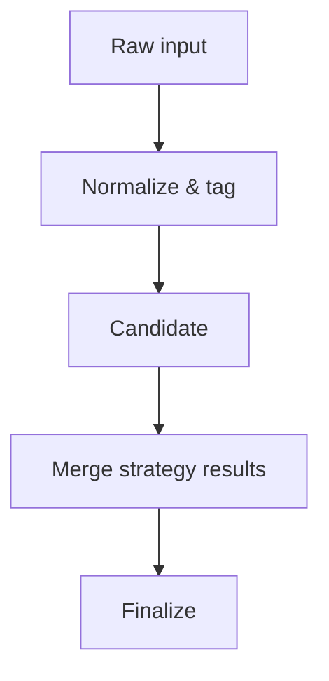

# Letters Router

The letters router coordinates generation and delivery of dispute letters.
This doc explains how data moves through the pipeline and how to extend it.

## Data Flow



- **Candidate** – letters produced after normalization and tagging.
- **Finalize** – the set after strategy results are merged and validation passes.

## Flags

| Flag | Default | Description |
|------|---------|-------------|
| `LETTER_ROUTER_VALIDATE` | `1` | Run schema validation on candidates before merging results. |
| `LETTER_ROUTER_STRICT` | `0` | When `1`, abort processing on the first validation error. |
| `LETTER_ROUTER_DEBUG` | `0` | Save intermediate artifacts for troubleshooting. |

Flags are read from the environment. A value of `0` disables the behavior.

## Required Fields

Every candidate must include the following fields:

- `account_id`
- `normalized_text`
- `strategy_key`

Finalized records add:

- `resolved_text`
- `delivery_channel`

## Optional Fields

These fields enrich the payload but are not mandatory:

- `attachments`
- `notes`
- `debug`

## Example

```json
{
  "account_id": "A-123",
  "normalized_text": "Dispute for account A-123",
  "strategy_key": "fcra-basic",
  "resolved_text": "Please remove account A-123",
  "delivery_channel": "mail",
  "attachments": ["id.pdf"]
}
```

Extending the router generally involves adding a new strategy module
and mapping it in `services/letters/router.py`.

## Metrics

- `router.candidate_selected.{action_tag}.{template_name}` – emitted for each
  candidate template selection.
- `router.finalized.{action_tag}.{template_name}` – emitted when a template is
  finalized.
- `router.missing_fields.{action_tag}.{template_name}.{field}` – emitted for
  every required field absent from a candidate.
- `router.missing_fields.finalize.{action_tag}.{field}` – emitted for missing
  fields after finalization.
- `router.sanitize_success.{template_name}` and
  `router.sanitize_failure.{template_name}` – outcomes of the post-render
  sanitizer.

Cardinality is bounded by the finite sets of action tags, template names and
required field identifiers.

### Grafana / Kibana panels

- **Candidate selection** – count of `router.candidate_selected.*` by tag and
  template. Alert if a tag registers zero selections for an hour.
- **Final template selection** – count of `router.finalized.*` grouped by tag
  and template to spot unexpected routing drops.
- **Candidate missing fields** – heatmap of `router.missing_fields.*` grouped by
  tag and field to surface validation gaps.
- **Finalize missing fields** – sum of
  `router.missing_fields.finalize.*` grouped by tag and field.
- **Sanitizer outcomes** – success vs failure rates from
  `router.sanitize_*.*`.
