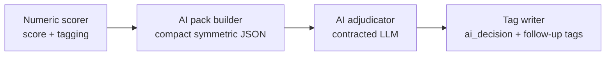

# Merge V2 AI Adjudication

This document covers the end-to-end AI adjudication flow that follows the numeric Merge V2 scorer. The scorer identifies high-similarity account pairs and feeds them into the AI adjudicator, which builds structured packs, calls the model, and writes the resulting tags.

## Flow overview



1. **Score** – the numeric 0–100 scorer emits `merge_pair` tags for every candidate pair and `merge_best` tags for each account’s best partner when `decision="ai"`.
2. **Pack** – for each AI candidate pair we construct a compact, symmetric JSON “pack” that contains the latest tradeline context and any curated fresh lines.
3. **Send** – the pack is sent to the Merge V2 AI adjudicator with a strict prompt contract. Calls include retry handling, log under `AI_ADJUDICATOR` prefixes, and populate the run manifest with pack and log paths.
4. **Tag** – we persist the adjudicator response for both accounts, writing `ai_decision` tags and, when applicable, supplemental tags such as `same_debt_pair`.

## AI decision vocabulary

The model must respond with one of three decisions:

- **`merge`** – the two tradelines refer to the same account. We queue them as merge candidates and downstream tooling can merge them once human or policy checks clear.
- **`same_debt`** – the tradelines describe the same underlying debt or story (for example, an original creditor and a collection agency) but are separate tradelines. We must not merge them. Instead, tag both directions with `same_debt_pair` so the case remains linked for review.
- **`different`** – the tradelines do not describe the same account or underlying debt. Record the negative decision and leave the accounts separate.

If the model response is missing, malformed, or any call fails after retries, we attach an `ai_error` tag so operators can manually follow up.

## Environment configuration

The AI adjudicator configuration is controlled through environment variables.

| Key | Default | Notes |
| --- | --- | --- |
| `ENABLE_AI_ADJUDICATOR` | `false` | Enables AI adjudication when truthy. Requires `OPENAI_API_KEY` to remain enabled. |
| `OPENAI_API_KEY` | _unset_ | API token; trimmed and required when the adjudicator is enabled. |
| `OPENAI_BASE_URL` | `https://api.openai.com/v1` | The model endpoint. Trailing slashes are stripped. |
| `AI_MODEL` | `gpt-4o-mini` | Primary model name. Falls back to `AI_MODEL_ID` when set. |
| `AI_MODEL_ID` | `gpt-4o-mini` | Legacy alias; only read when `AI_MODEL` is empty. |
| `AI_REQUEST_TIMEOUT` | `30` | Request timeout (seconds) for adjudicator calls. Minimum enforced at 1 second. |
| `AI_PACK_MAX_LINES_PER_SIDE` | `20` | Maximum number of “fresh lines” included per account side. Minimum enforced at 5 lines. |
| `AI_MAX_RETRIES` | `1` | Number of retry attempts when the upstream model errors. |
| `AI_MAX_TOKENS` | `600` | Token cap for adjudicator responses. |
| `AI_TEMPERATURE_DEFAULT` | `0.0` | Default temperature when not otherwise specified. |
| `AI_MIN_CONFIDENCE` | `0.70` | Minimum confidence threshold for downstream gating. |
| `AI_REQUEST_TIMEOUT_S` | `8` | Legacy timeout used by other AI helpers; included here for completeness. |

When defaults are used due to invalid inputs (e.g., empty strings or values below the enforced minimum), we emit a `MERGE_V2_CONFIG_DEFAULT` warning. When the adjudicator is explicitly enabled but lacks an API key, initialization logs `MERGE_V2_AI_DISABLED` and falls back to disabled mode.

## CLI quick start (PowerShell)

```powershell
# 1. Configure environment
$env:ENABLE_AI_ADJUDICATOR = "1"
$env:OPENAI_API_KEY = "sk-your-key"
$env:AI_MODEL = "gpt-4o-mini"      # optional override
$env:RUNS_ROOT = "C:\\finance\\runs" # optional when not using ./runs

# 2. Build packs and adjudicate an SID
poetry run python scripts/adjudicate_pairs.py --sid 2024-05-001 --runs-root $env:RUNS_ROOT --only-missing
```

The helper script rebuilds packs before each adjudication pass, logs `MERGE_V2_MANUAL_*` events, and writes the resulting AI decisions and supplemental tags back into the run.

## Special handling: accounts 11 ↔ 16

For the scenario with summary total `59`, strong balance alignment, identical open dates, and matching owed amounts, the adjudicator should produce at least `same_debt` unless it finds strong contradictory evidence. When the response is `same_debt`, write symmetric `same_debt_pair` tags (`11 → 16` and `16 → 11`). Do **not** automatically promote the pair to a merge candidate solely on a `same_debt` response.
