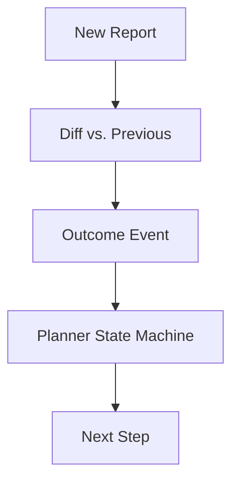

# Report Outcomes

This document outlines how the platform processes report outcomes through diffing, classification, and planner integration to determine the next steps in the workflow.

## Report Diffing

Each incoming report is compared against the most recent prior version. The diff highlights changes that drive downstream decision making and enable concise outcome tracking.

## Outcome Classification

Differences detected in the report are categorized into outcome types. These classifications summarize the impact of the changes and trigger specific events.

## Planner Integration

Outcome events feed into the planner, which advances its internal state machine to schedule follow-up actions or escalate issues.

## SLA Gates

The pipeline enforces service level agreement (SLA) gates at key points. Missing an SLA gate surfaces alerts and may block further processing.

## Processing Flow



## Runbook

### Reprocessing Outcomes

1. Identify the report and outcome needing reprocessing.
2. Retrigger the diffing job with the original inputs.
3. Verify the new outcome classification and planner state transition.

### Handling Ingestion Failures

1. Review ingestion logs to locate the failure point.
2. Correct any upstream data issues and restart the ingestion step.
3. Confirm that the report diff and outcome classification complete successfully.

### Interpreting Metrics

1. Monitor outcome throughput and SLA adherence dashboards.
2. Investigate drops in processed reports or rising SLA breaches.
3. Use the metrics to fine-tune planner rules and capacity planning.

### Rollback

1. Disable outcome ingestion by setting `ENABLE_OUTCOME_INGESTION` to `false`.
2. Alternatively, set `OUTCOME_INGESTION_CANARY_PERCENT` to `0` to bypass planner updates.
3. Re-enable by restoring the flag or increasing the canary percentage when ready.

## Performance

Benchmarking with `scripts/benchmark_ingestion.py` shows the pipeline processes
roughly 100 synthetic reports per second on a typical developer machine,
translating to an average latency of ~10 ms per report. Results will vary based
on hardware and the complexity of the input report.

## Correlation Query Example

Logs now include `session_id`, `family_id`, `cycle_id`, and `audit_id` fields.
To trace a single account across tri-merge, planner, and outcome stages, filter
by these identifiers:

```sql
-- Example SQL-style query against the logging backend
SELECT * FROM logs
WHERE session_id = 'sess1' AND family_id = 'fam42' AND cycle_id = 0
ORDER BY timestamp;
```

This returns all related events, enabling end-to-end correlation of a dispute
through the pipeline.
