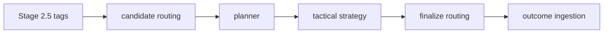

# Planner

The planner orchestrates account progression through the credit repair pipeline. It evaluates each account's state, decides when to schedule the next dispute action, and emits metrics for operational visibility.

## StrategyPlan

`StrategyPlan` is the container returned by strategists that holds `StrategyItem` recommendations for every account in scope. Each recommendation may include a recommended action, rule hits, and notes used later by tactical strategy and letter generation.

## AccountState

`AccountState` tracks where an account currently sits in the pipeline.

Fields:

- `account_id`: unique identifier
- `current_cycle` and `current_step`: planner cycle/step counters
- `status`: `AccountStatus` such as `PLANNED`, `SENT`, or terminal CRA responses
- `last_sent_at` and `next_eligible_at`: timestamps used for SLA gates
- `history`: list of `StateTransition` records for auditing

## State machine

`planner.state_machine.evaluate_state` interprets an `AccountState` instance and returns the allowed planner tags along with the next time the account is eligible for work. The machine flows:

1. **PLANNED** → the first dispute can be sent immediately (`dispute` tag).
2. **SENT** → the planner waits for the SLA window before allowing a follow‑up (`followup` tag).
3. **CRA_RESPONDED_* or COMPLETED** → terminal; no further actions.

History is serialized with `dump_state` and restored using `load_state` to support auditing and replay.

## SLA gates

After a letter is sent the planner enforces a default 30‑day SLA before any subsequent action may be scheduled. Accounts attempted before the deadline are skipped and `planner.time_to_next_step_ms` records the wait time. If work is performed after the deadline, the `planner.sla_violations_total` counter increments.

## Integration points

The planner sits after candidate routing. It consumes Stage 2.5 tag output and determines which accounts proceed to tactical strategy. Once tactics finalize routing, outcomes are ingested back into the system, updating `AccountState` for the next planner cycle.

## Runbook

### Monitoring metrics

- `planner.cycle_progress{cycle,step}` – counts step transitions per cycle.
- `planner.time_to_next_step_ms` – milliseconds until the next eligible action (gauge; alert on sustained spikes).
- `planner.resolution_rate` – fraction of accounts resolved in a run (target ≥0.8, single gauge).
- `planner.avg_cycles_per_resolution` – average cycles per resolved account (gauge; alert if above historical p95).
- `planner.sla_violations_total` – total number of SLA breaches.
- `planner.error_count` – total planner exceptions.
- `router.candidate_selected.*` and `router.finalized.*` – verify routing
  throughput when the planner pipeline is enabled.

Dashboard alerts should watch for sustained drops in resolution rate, increases in cycle count, or spikes in SLA violations and errors.

To roll back, deploy with `ENABLE_PLANNER_PIPELINE=0` to restore the legacy router ordering without planner intervention.

### Handling SLA violations

1. Check `planner.sla_violations_total` and identify offending accounts.
2. Confirm `last_sent_at` and `next_eligible_at` in the account's `AccountState`.
3. Reschedule the account and notify operations if the breach was caused by upstream delay.

### Replaying account history

1. Retrieve the serialized state stored by the session manager.
2. Use `planner.state_machine.load_state` to recreate the `AccountState`.
3. Step through `evaluate_state` to simulate prior decisions or to verify a bug fix before rerunning the planner.
