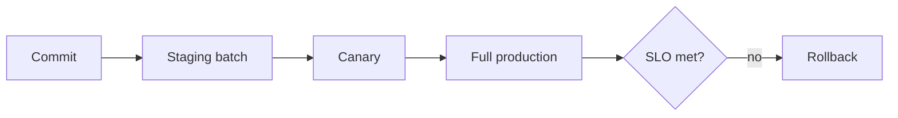

# Author Letters Pipeline Release Runbook

This runbook describes how to ship a safe change to the author letters pipeline.

## Overview

### Validation field scope

Validation only investigates the 21 fields documented in
[`docs/validation.md`](validation.md). Treat the 18 "always-investigatable"
fields as hard requirements—any cross-bureau mismatch or missing value should
open/keep a case. The three conditional fields
(`creditor_remarks`, `account_rating`, `account_number_display`) stay in the
pipeline but only elevate to **strong** disputes when the content substantiates
the claim. `account_description`, `dispute_status`, and `last_verified` remain
informational-only and must not trigger escalations.

## Staging Batch

1. Merge the change to `main`.
2. Build and push the container.
3. Run a batch on staging data.
4. Verify logs and sample outputs.

## Canary Steps

1. Deploy to 5% of traffic.
2. Monitor error rates and latency for 30 minutes.
3. If healthy, expand to 50%, then 100%.

## SLO Thresholds

- Success rate ≥ 99%.
- P95 latency ≤ 2s for routing.
- No more than 0.1% invalid letters.

## Monitoring

Dashboards should surface the following counters:

- `rulebook.tag_selected.{tag}` – frequency of chosen action tags.
- `rulebook.suppressed_rules.{rule_name}` – rules skipped due to precedence or exclusion.
- `planner.*` – cycle progress, SLA waits and error counts.
- `outcome.verified`, `outcome.updated`, `outcome.deleted`, `outcome.nochange` – bureau classification distribution (each counter ≤cardinality 1; alert if `outcome.deleted` spikes above baseline).
- `router.*` – candidate and finalize template selections and validation errors.

## Rollback

1. Revert to the previous container tag.
2. Disable new features behind flags if available, e.g. set
   `ENABLE_PLANNER_PIPELINE=0` to bypass the planner pipeline or
   `ENABLE_FIELD_POPULATION=0` (or lower `FIELD_POPULATION_CANARY_PERCENT`)
   to skip field population.
3. Post-mortem within 24 hours.
